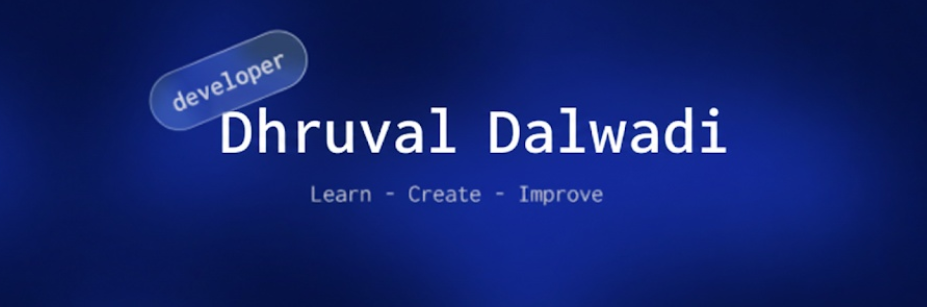

  

 

  

   &nbsp;&nbsp;
   &nbsp;&nbsp;
   &nbsp;&nbsp;
  

  

  
Self-taught developer from Gujarat, learning deeply across the stack and building projects that make a difference.

  
💻 Tech Stack

   

   
   
  
   
   
   
  
   
   
   
  

  
📊 GitHub Stats

   

  <!-- GitHub Stats Section -->
  <table>
    <tr>
      <td colspan="2" align="center">
        
        
      </td>
    </tr>
  </table>
       

### ✍️ Random Dev Quote

<!-- Proudly created with GPRM ( https://gprm.itsvg.in ) -->
